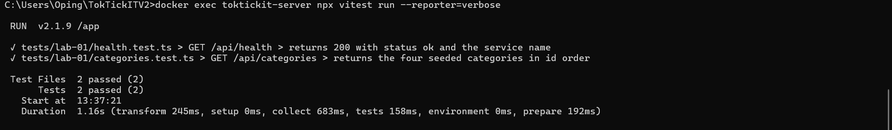
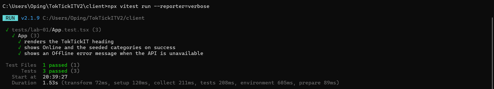

# Lab 1 — Test Plan and Evidence

All test files live under `server/tests/lab-01/` and `client/tests/lab-01/`.

## Summary

| # | Tool | Test | Result |
|---|------|------|--------|
| 1 | Supertest | `GET /api/health` returns 200, `status=ok` | ✅ Passed |
| 2 | Supertest | `GET /api/categories` returns 4 seeded categories in id order | ✅ Passed |
| 3 | Vitest | Heading renders | ✅ Passed |
| 4 | Vitest | Success state shows Online + category list | ✅ Passed |
| 5 | Vitest | Error state shows Offline + message | ✅ Passed |

**Totals:** Backend 2/2 · Frontend 3/3 · **5/5 passed**

---

## How to reproduce

### Backend — Tests 1 & 2 (Supertest)

Run inside the server container so the tests reach the seeded PostgreSQL
database over the compose network (`db:5432`):

```bash
docker exec toktickit-server npx vitest run --reporter=verbose
```

> **Note:** run this via `docker exec`, not a plain `npm test` on the host. A
> native PostgreSQL on `localhost:5432` can shadow the Docker database from the
> host and make the backend tests fail authentication. Running inside the
> container avoids the conflict.

### Frontend — Tests 3, 4 & 5 (Vitest)

No database needed — the API module is mocked with `vi.spyOn`:

```bash
cd client
npx vitest run --reporter=verbose
```

---

## Evidence

### Backend (Supertest) — Tests 1 & 2



```text
 ✓ tests/lab-01/health.test.ts > GET /api/health > returns 200 with status ok and the service name
 ✓ tests/lab-01/categories.test.ts > GET /api/categories > returns the four seeded categories in id order

 Test Files  2 passed (2)
      Tests  2 passed (2)
```

### Frontend (Vitest) — Tests 3, 4 & 5



```text
 ✓ tests/lab-01/App.test.tsx > App > renders the TokTickIT heading
 ✓ tests/lab-01/App.test.tsx > App > shows Online and the seeded categories on success
 ✓ tests/lab-01/App.test.tsx > App > shows an Offline error message when the API is unavailable

 Test Files  1 passed (1)
      Tests  3 passed (3)
```
