# Lab 2 — Submission

**Poomipat Apiwattanaphong — 67070501035**
**CPE 334 Introduction to Software Engineering in the Age of AI Agents · Semester 1/2026**
**Repository:** <https://github.com/Menelaus122/TokTickITV2>
**Peer reviewer:** Wirachat — 67070501041 — [@WirachatTH](https://github.com/WirachatTH)

> **How to use this file.** It is the source for the single submitted PDF and
> uses the exact headings the labsheet requires, *Answer Part 1* through
> *Answer Part 9*, in order. Every figure it references is committed under
> `docs/lab-02/image/`, except the two marked **[TO CAPTURE]** — the Project
> board needs a signed-in browser, and the `main` commit history cannot exist
> until the release Pull Request is merged.

---

# Answer Part 1: Git Use with Engineering Workflow

**Branch flow.** `lab2-staging` was created from `main` after Lab 1. Each Issue
was implemented on its own feature branch and entered `lab2-staging` through a
peer-reviewed Pull Request. Nothing was developed or pushed directly to
`main` or `lab2-staging`.

| Issue | Branch | PR | Approved & merged by |
| :--- | :--- | :--- | :--- |
| 1 Sprint specification and test plan | `feature/1-sprint-specification` | [#20](https://github.com/Menelaus122/TokTickITV2/pull/20) | WirachatTH |
| 2 Database and seed data | `feature/2-database-and-seed` | [#21](https://github.com/Menelaus122/TokTickITV2/pull/21) | WirachatTH |
| 3 UI foundation | `feature/3-ui-foundation` | [#22](https://github.com/Menelaus122/TokTickITV2/pull/22) | WirachatTH |
| 4 Development Requester context | `feature/4-requester-context` | [#23](https://github.com/Menelaus122/TokTickITV2/pull/23) | WirachatTH |
| 5 Ticket creation | `feature/5-ticket-creation` | [#24](https://github.com/Menelaus122/TokTickITV2/pull/24) | WirachatTH |
| 6 My Tickets | `feature/6-my-tickets` | [#25](https://github.com/Menelaus122/TokTickITV2/pull/25) | WirachatTH |
| 7 Ticket Detail and attachments | `feature/7-ticket-detail-attachments` | [#26](https://github.com/Menelaus122/TokTickITV2/pull/26) | WirachatTH |
| 8 Reference data API and shell navigation | `feature/8-reference-data-and-shell` | [#27](https://github.com/Menelaus122/TokTickITV2/pull/27) | WirachatTH |
| 9 Automated test suite and visual artifacts | `feature/9-automated-tests-and-screenshots` | [#28](https://github.com/Menelaus122/TokTickITV2/pull/28) | WirachatTH |
| 10 Create Ticket completion | `feature/10-create-ticket-completion` | [#30](https://github.com/Menelaus122/TokTickITV2/pull/30) | WirachatTH |
| 11 Staging integration and delivery | `docs/lab2-final-delivery` | *(release PR)* | WirachatTH |

**[TO CAPTURE] 1.1 — Commit history on the final `main` branch**, showing the
feature branches merged into `lab2-staging` and then into `main`. This cannot be
taken until the release Pull Request is merged, because until then `main` still
holds only Lab 1. Suggested view:
<https://github.com/Menelaus122/TokTickITV2/network>, or
`git log --oneline --graph --all`.

The staging half of that history is already captured, and shows every feature
branch merging into `lab2-staging`:

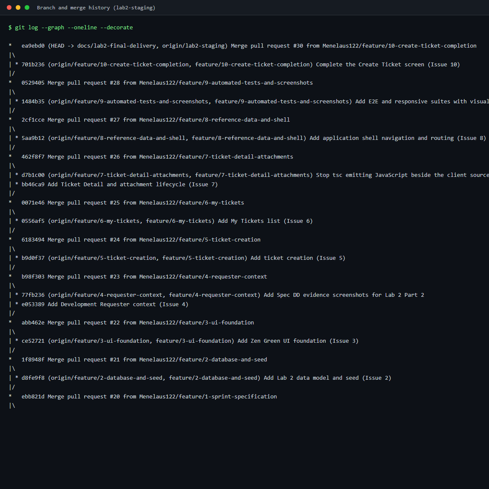

**[TO CAPTURE] 1.2 — GitHub Project board** with every Issue in **Done**.
Issues 1–10 are closed on GitHub; Issue 11 is this delivery work.

**1.3 — Peer review record.** Rendered copy of
[`docs/lab-02/reviewer.md`](reviewer.md): reviewer identity, PR links, every
comment received, my response to each, and all ten approvals. Every merge was
performed by the reviewer, never by me, per the Part 9 workflow agreement.

**1.4 — `README.md` and `.gitignore` contents.**
`README.md` carries the current setup, seed, and test commands for Lab 2.
`.gitignore` covers `node_modules/`, `.env`, build output, uploaded attachment
files (`server/uploads/` — the metadata lives in PostgreSQL), compiled `.js`
emitted beside client sources, and Playwright scratch output, while keeping the
checklist screenshots under `artifacts/lab-02/screenshots/` tracked.

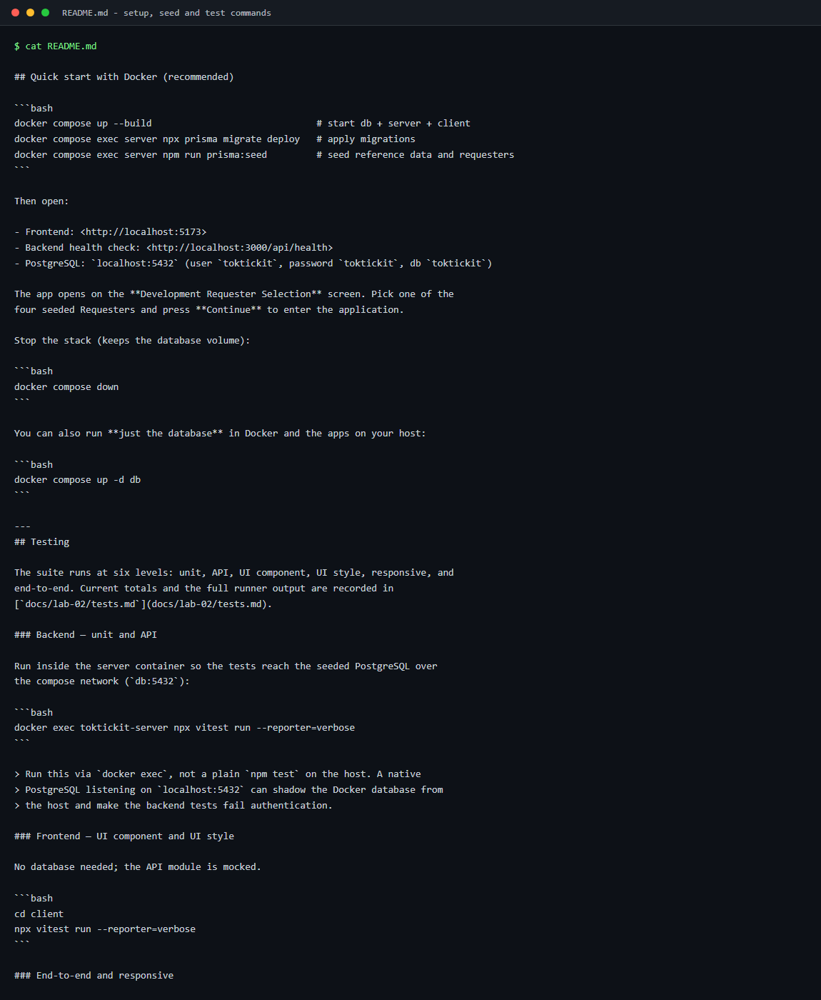

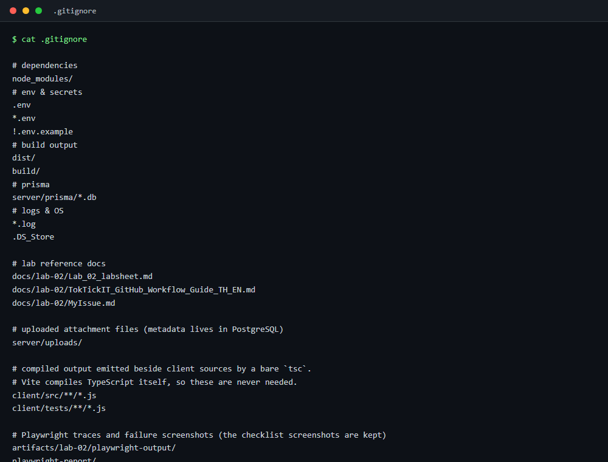

**1.5 — Repository directory structure**, showing `client/`, `server/`,
`e2e/lab-02/`, `artifacts/lab-02/screenshots/`, and `docs/lab-02/`.

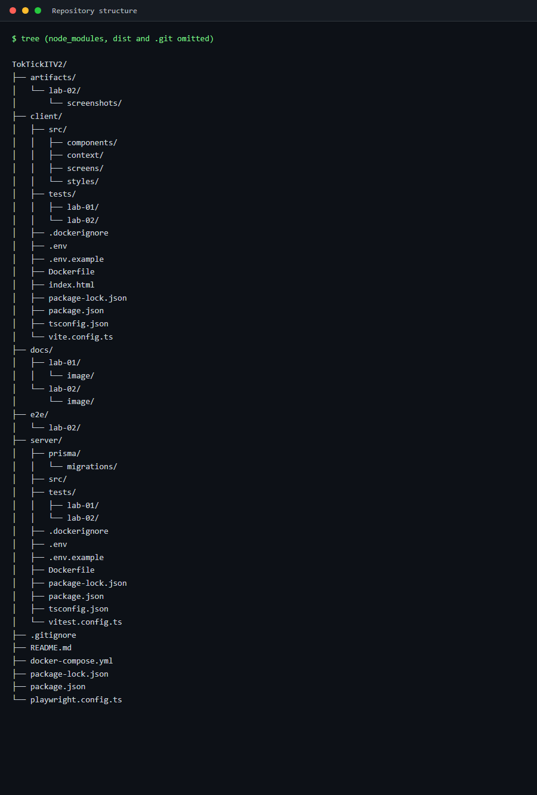

---

# Answer Part 2: Spec DD

**Document:** [`docs/lab-02/specification.md`](specification.md) —
<https://github.com/Menelaus122/TokTickITV2/blob/main/docs/lab-02/specification.md>

The specification was written and merged **before** any implementation PR, which
is what Spec-Driven Development requires.

| Section | Contents |
| :--- | :--- |
| §4 Functional Requirements | **FR-01 … FR-33** |
| §5 Business Rules | **BR-01 … BR-46**, covering defaults, requester selection, ownership, search and pagination, validation, attachments, and the Lab 3 transition |
| §9 Acceptance Criteria | **AC-01 … AC-28**, each Given/When/Then |
| §10 Definition of Done | Two parts — product completion and course delivery |
| §11 Assumptions and Decisions | D-01 … D-10, the choices not fixed by the handout |

**Proof it existed before implementation.** Commit `cd444f5` added all four
contract documents; PR #20 merged them into `lab2-staging` at **16:47 UTC on
25 Aug 2026**. The first implementation PR (#21) was opened at **17:13 UTC** —
26 minutes later.

Evidence images already captured in `docs/lab-02/image/`:

- `spec-dd-proof-pr20-merged.png` — PR #20 merged, with the approval and linked Issue
- `spec-dd-proof-commit-history.png` — the file's commit history and date
- `spec-dd-rendered-1-overview.png` … `spec-dd-rendered-5-definition-of-done.png` — the rendered specification

---

# Answer Part 3: Test DD and Traceability

**Document:** [`docs/lab-02/tests.md`](tests.md)

The test plan was written in Issue 1, before implementation, with every row
marked *Planned*. Rows became *Pass* only once the test existed and had actually
been run — never on the strength of a code review or an agent's claim.

**Final results**

| Level | Planned | Delivered | Passed | Failed | Skipped |
| :--- | ---: | ---: | ---: | ---: | ---: |
| Unit | 5 | 73 | 73 | 0 | 0 |
| API | 28 | 88 | 88 | 0 | 0 |
| UI component | 18 | 182 | 182 | 0 | 0 |
| UI style | 6 | 38 | 38 | 0 | 0 |
| Responsive | 4 | 9 | 9 | 0 | 0 |
| E2E | 4 | 12 | 12 | 0 | 0 |
| **Total** | **65** | **402** | **402** | **0** | **0** |

73 + 88 = 161 backend · 182 + 38 = 220 frontend · 9 + 12 = 21 Playwright.

**Traceability.** `tests.md` §3 maps all **28 acceptance criteria** to the tests
that prove them; no AC is unmapped. §2 lists every planned test with its real
file path and final status.

**3.1 — Backend suite passing**, 161 of 161 across 11 files.

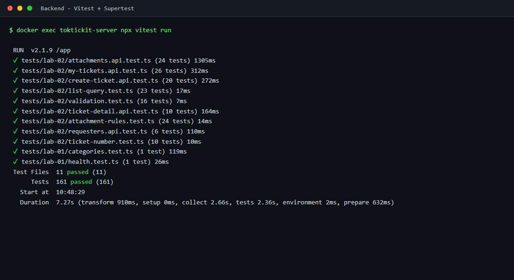

**3.2 — Frontend suite passing**, 220 of 220 across 11 files.

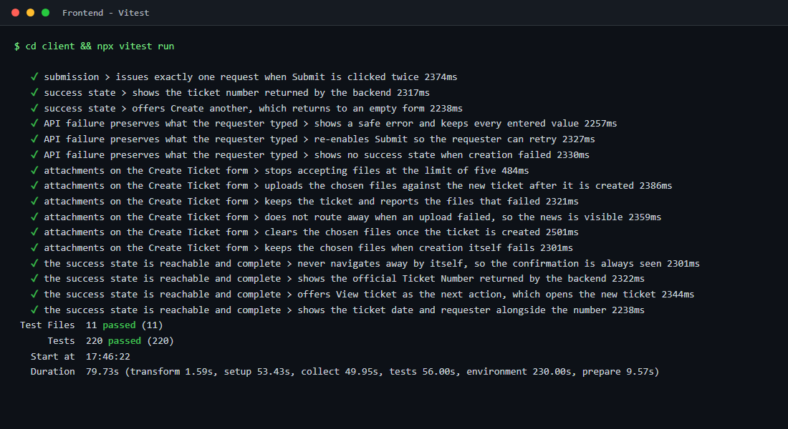

**3.3 — End-to-end and responsive suites passing**, 21 of 21.

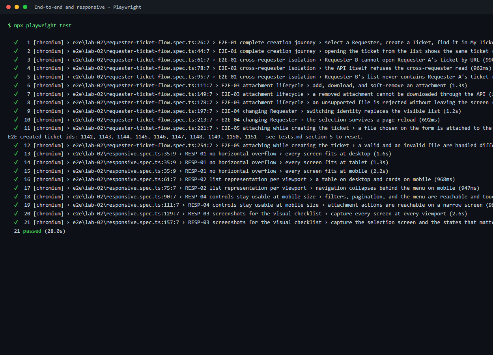

Commands are in `tests.md` §5 and in the README.

---

# Answer Part 4: AI Use with Reflection

**Document:** [`docs/lab-02/ai-use.md`](ai-use.md)

**LLM used:** Claude Opus 5, through Claude Code. Every commit carries
`Co-Authored-By: Claude Opus 5`, so the contribution is traceable in `git log`
rather than only asserted.

The document contains ten selected key prompts with what I did with each result,
followed by my reflection. The three that mattered most:

- **Auditing the plan before coding.** Having the agent check `MyIssue.md`
  against the labsheet found six gaps and grew the sprint from 7 issues to 10.
- **Numbers in prose are not evidence.** My reviewer caught the agent
  overstating per-file test counts in a PR description. After that I required
  every number to come from runner output and to sum correctly.
- **Auditing again at the end, twice.** The first post-implementation audit
  found the missing Create Ticket attachments; I did not accept it as complete
  and asked for another pass, which found three more gaps. All four became
  Issue 10.

---

# Answer Part 5: Development Requester Select Screen

The simulated login used to choose the Requester for the session. **Not
authentication** — the screen says so on its face, and the wording is the
labsheet's suggested text verbatim.

Screenshots in `artifacts/lab-02/screenshots/requester-selection/`:
`desktop.png`, `tablet.png`, `mobile.png`.

Required elements, all present: TokTickIT title; the testing-only explanation as
an amber warning; a labelled, keyboard-accessible dropdown of **active**
Requesters loaded from PostgreSQL; a Continue button disabled until a choice is
made; and distinct loading, empty, and safe API-failure states.

After selection the shell shows the Requester's name with a **Change Requester**
action, and requester-scoped data reloads whenever the selection changes.

---

# Answer Part 6: Working Ticket Screen — Create Mode

Screenshots in `artifacts/lab-02/screenshots/create-ticket/`:

| Required state | File |
| :--- | :--- |
| Initial | `desktop.png` (also `tablet.png`, `mobile.png`) |
| Validation failure | `validation-failure.png` |
| Success | `success.png` |
| API failure | `api-failure.png` |
| Invalid attachment | `invalid-attachment.png` |
| Submitting | Transient in-flight state; asserted by a UI test rather than photographed |

**1. Reference data loaded from the database.** Category and Related System
options come from `GET /api/categories` and `GET /api/related-systems`; nothing
is hard-coded. A UI test asserts the rendered options match the API response.

**2. Invalid submission shows field-level messages.** `validation-failure.png`
shows each message directly beneath its own field, with red asterisks on the
required labels. No API request is issued when the client already knows the form
is invalid.

**3. One valid and one invalid attachment.** `invalid-attachment.png` shows a
permitted file queued while a rejected one stays visible with its reason.
Validation happens on selection — permitted type *and* matching MIME type, 5 MB
per file, at most 5 files — so a rejected file is never uploaded.

**4. Backend stopped, safe error state with values preserved.**
`api-failure.png` was captured with the `POST /api/tickets` route aborted. All
five entered values survive beneath a safe message that names no status code,
URL, or stack trace.

**Ticket Number and saved values come from the backend.** The form displays
Ticket Number and Ticket Date as read-only "Generated on submit" placeholders.
The server generates `TT-<YYYY>-<NNNNN>`, and API tests confirm that a
client-supplied `ticketNumber`, `requesterId`, or `currentStatus` in the request
body is discarded.

**The Requester field comes from the selection, and the saved ticket matches.**
The Requester is taken from the `X-Requester-Id` header, never the body. An API
test reads the row back and asserts `requesterId` equals the header value.

**6.1 — the created tickets in the database.** The official Ticket Numbers, the
`requesterId` matching the selected Development Requester, and the `NEW` status
all come from the backend, not the form.

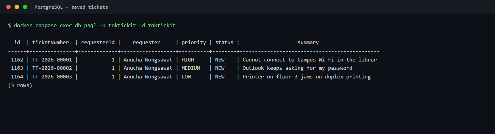

---

# Answer Part 7: Working My Tickets Screen

Screenshots in `artifacts/lab-02/screenshots/my-tickets/`: `desktop.png`,
`tablet.png`, `mobile.png`, `no-results.png`.

The list is scoped to the selected Requester by the database query itself, not
by a check applied after fetching, so there is no code path that can retrieve
another Requester's rows and forget to discard them.

Verified live:

```text
search=LAPTOP                    -> 1   (case-insensitive)
requestedPriority=HIGH           -> 1
categoryId=2 AND priority=HIGH   -> 0   (filters AND together)
sortDir=asc                      -> oldest first
pageSize 10 / 20 / 50            -> accepted
page=99                          -> HTTP 200, empty, not 404
sortBy=summary                   -> 400 INVALID_QUERY
X-Requester-Id: 1, no filters    -> only that requester's own ticket
X-Requester-Id: 1, search for A's ticket -> 0 results
```

**Empty vs no-results** are distinct states with different copy and different
actions: "You have no tickets yet" offers Create Ticket; "No tickets match your
filters" offers Clear Filters.

**7.1 — Requester A selected, showing their three tickets.**

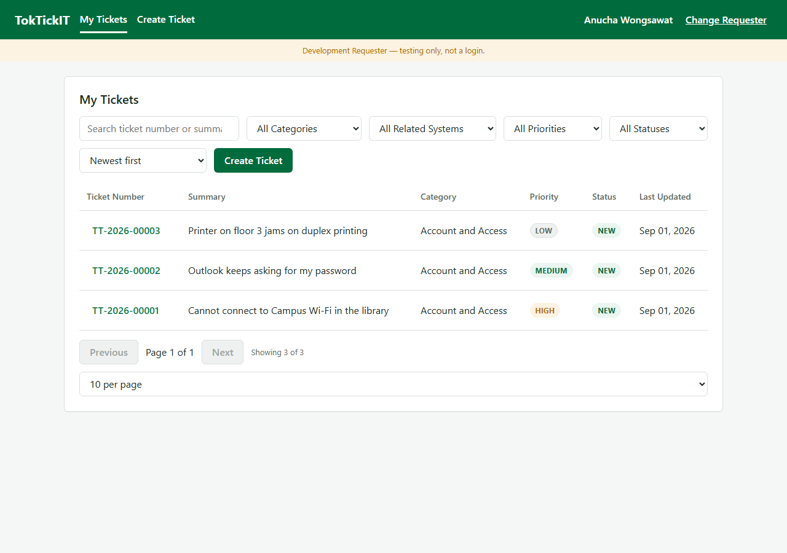

**7.2 — after Change Requester to B, none of A's tickets remain.**

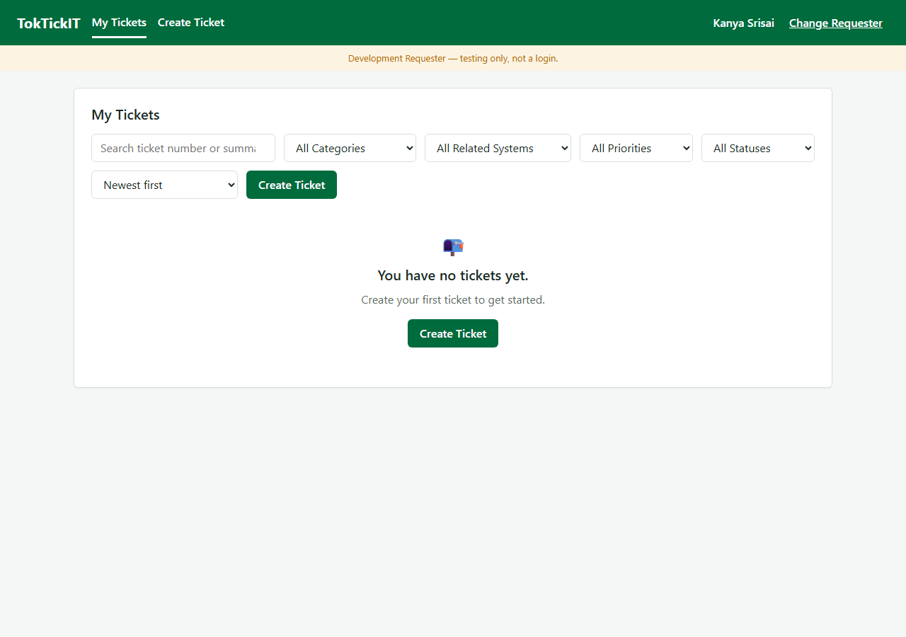

**7.3 — and A's ticket URL is not reachable as B.** The same answer a
non-existent ticket gives, so the API never discloses that it exists.

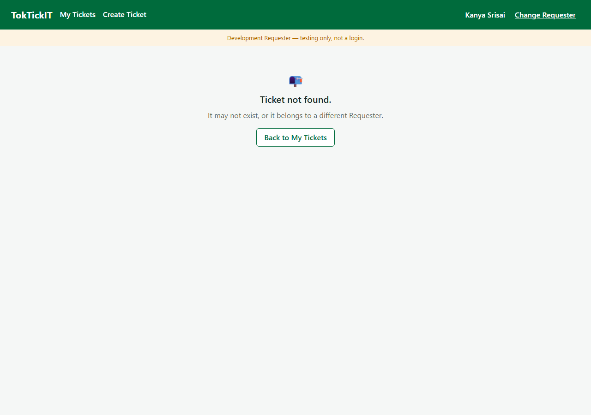

Cross-requester evidence is also automated: `E2E-02` switches identity in a real
browser and confirms that A's tickets vanish from B's list and that A's ticket
URL shows "Ticket not found".

---

# Answer Part 8: Working Ticket Screen — View Mode and Attachments

Screenshots in `artifacts/lab-02/screenshots/ticket-detail/`: `desktop.png`,
`tablet.png`, `mobile.png`, `removal-confirm.png`, `attachment-removed.png`,
`invalid-attachment.png`, `not-found.png`.

**Owned Ticket Detail is read-only.** Every field renders as plain text, not as
disabled inputs — a UI test asserts the count of `input`, `textarea`, and
`select` elements inside the ticket information region is exactly **0**.

**The attachment lifecycle**, verified against a live server:

```text
upload report.pdf     -> 201, downloadUrl issued
upload virus.exe      -> 415 UNSUPPORTED_FILE_TYPE
upload 6 MB pdf       -> 413 FILE_TOO_LARGE
6th active file       -> 409 ATTACHMENT_LIMIT_REACHED
download active       -> 200, Content-Disposition: attachment; filename="report.pdf"
remove, blank reason  -> 400, fields.removalReason
remove, valid reason  -> 200, removedAt set, downloadUrl: null
download removed      -> 410 ATTACHMENT_REMOVED, zero bytes returned
remove the same twice -> 409 ATTACHMENT_ALREADY_REMOVED
```

**Retained metadata.** `attachment-removed.png` shows the removed file still
listed with its name, size, and removal reason, struck through and badged
**REMOVED**, with no download or remove control — and the count reading
"0 of 5 active".

**Unauthorized access is rejected.**

```text
requester 1 -> ticket of requester 3      -> 404 "That ticket could not be found."
requester 1 -> attachment of requester 3  -> 404 "That attachment could not be found."
```

404 rather than 403 is deliberate (D-02): a 403 would confirm the ticket exists
and belongs to someone else. An API test asserts the not-owned and not-found
bodies are byte-identical.

---

# Answer Part 9: Zen Green UI and Responsive Evidence

**Document:** [`docs/lab-02/ui-spec.md`](ui-spec.md) — colour tokens,
typography and spacing, control states, required-field marker and validation
placement, button hierarchy, badge rules, screen layouts, responsive rules,
accessibility rules, and the visual inspection checklist.

**Screenshots — 21 files** in `artifacts/lab-02/screenshots/`, covering four
screens at all three viewports (1280 × 800, 900 × 1000, 375 × 812) plus nine
states that only a screenshot can record.

**Completed visual checklist:** `tests.md` §4 — 19 rows, each naming the
automated assertion or artifact that proves it, so no line rests on someone
having glanced at a page.

| Check | Desktop | Tablet | Mobile |
| :--- | :---: | :---: | :---: |
| No horizontal page scrolling | ✅ | ✅ | ✅ |
| No clipped labels | ✅ | ✅ | ✅ |
| No overlapping messages or controls | ✅ | ✅ | ✅ |
| Zen Green tokens applied | ✅ | ✅ | ✅ |
| Read-only fields visually distinct from editable | ✅ | ✅ | ✅ |
| Required asterisks present | ✅ | ✅ | ✅ |
| Validation messages beneath their field | ✅ | ✅ | ✅ |
| Button hierarchy correct | ✅ | ✅ | ✅ |
| Badges consistent everywhere | ✅ | ✅ | ✅ |
| Ticket list: table ≥ 992 px, cards < 768 px | ✅ | n/a | ✅ |
| Touch targets at least 44 px | n/a | n/a | ✅ |

**Colour tokens**, all asserted by test to be present at exactly these values:
`--tt-green-primary: #006B3C`, `--tt-green-secondary: #0B7A46`,
`--tt-green-pale: #EAF6EF`, `--tt-bg-page: #F5F7F6`. A further test asserts no
literal hex appears anywhere outside the `:root` token block.

Responsive behaviour is not merely asserted in CSS: `RESP-01` loads all four
screens at each of the three viewports in a real browser and checks
`scrollWidth <= clientWidth`; `RESP-02` confirms the table/cards switch; and
`RESP-04` measures the mobile menu toggle against the 44 px touch target.
